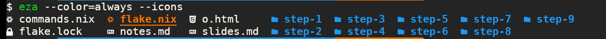

# From Bash To Nix

Note: 
- wellcome
- presenting myself
- what is bash? glue lang


<!--s-->
 <!-- .element width="65%" -->

Note:
- what is nix? super glue lang
- what is the problem with bash only
- Without nix it is a lot harder to leverage different tools from different enviornoments.

<!--s-->
### flake.nix
```nix
{
  outputs = { self, nixpkgs }:
  let system = "x86_64-linux";
  pkgs = import nixpkgs { inherit system;};
  in
  {
    devShells.${system}.default = pkgs.mkShell {
      buildInputs = with pkgs; [
      ];
    };
  };
}

```
Notes:
- describe flake 
- Flake allows us to use nix and its packages with a lock file 
- Flake allows you to describe an entire Git repository as a reliable collection of packages:
  - dev environments that contains dependecies related to your project 
      this is usually a good starting point when you try to "discover" a project 

  - definition of the current project, its dependencies and how to build  
  - flake notice board and it gives a heads up what is in the project
<!--v-->
### flake.nix
```nix
{
  outputs = { self, nixpkgs }:
  let system = "x86_64-linux";
  pkgs = import nixpkgs { inherit system;};
  in
  {
    devShells.${system}.default = pkgs.mkShell {
      buildInputs = with pkgs; [
        nodejs
      ];
    };

  };
}

```
<!--v-->
```console
nix develop
# create server.js
node server.js
# check browser at localhost:3000

```
<!--v-->
```js
const { createServer } = require('node:http');

const hostname = '127.0.0.1';
const port = 3000;

const server = createServer((req, res) => {
  res.statusCode = 200;
  res.setHeader('Content-Type', 'text/plain');
  res.end('Hello World');
});

server.listen(port, hostname, () => {
  console.log(`Server running at http://${hostname}:${port}/`);
});

```
<!--v-->


<!--s-->
```nix
{
  outputs = { self, nixpkgs }:
  let system = "x86_64-linux";
  pkgs = import nixpkgs { inherit system;};
  in
  {
    packages.${system}.default = pkgs.writeShellScriptBin "run" ''
          nix develop -c -- node server.js
    '';
    devShells.${system}.default = pkgs.mkShell {
      buildInputs = with pkgs; [
        nodejs
      ];
    };

  };
}

```
<!--v-->
```console
nix run     
# Server running at http://127.0.0.1:3000/

```
<!--s-->
```nix
{
  outputs = { self, nixpkgs }:
  let system = "x86_64-linux";
  pkgs = import nixpkgs { inherit system;};
  in
  {
    packages.${system} = {
      start-server = pkgs.writeShellScript "run-server" ''
          node server.js
      '';
      # nix run should still start the service
      default = pkgs.writeShellScriptBin "run" ''
          nix develop -c -- ${self.packages.${system}.start-server}
      '';
    };
    devShells.${system}.default = pkgs.mkShell {
      buildInputs = with pkgs; [
        nodejs
        # this wont work anymore becuase it is not a folder that contains bin with exectuable
        # self.packages.${system}.start-server
      ];
    };

  };
}

```
<!--v-->
```console
$ nix build .\#start-server
$ cat ./result               
#!/nix/store/4vzal97iq3dmrgycj8r0gflrh51p8w1s-bash-5.2p26/bin/bash
node server.js
$ nix run .\#start-server
error: unable to execute '/nix/store/2iplb5a63gn7m52ygljrwylp2jnjzwk2-run-server/bin/run-server': Not a directory

$ nix build                
$ cat result/bin/run 
#!/nix/store/4vzal97iq3dmrgycj8r0gflrh51p8w1s-bash-5.2p26/bin/bash
nix develop -c -- /nix/store/2iplb5a63gn7m52ygljrwylp2jnjzwk2-run-server

$ nix run
Server running at http://127.0.0.1:3000/
$ ./result/bin/run  
Server running at http://127.0.0.1:3000/


```
<!--s-->
```nix
{ pkgs ? import <nixpkgs> {} }:
/*
https://noogle.dev/f/lib/mapAttrs
mapAttrs (name: value: name + "-" + value)
   { x = "foo"; y = "bar"; }
=> { x = "x-foo"; y = "y-bar"; }


https://noogle.dev/f/lib/fix
fix (self: { foo = "foo"; bar = "bar"; foobar = self.foo + self.bar; })
=> { bar = "bar"; foo = "foo"; foobar = "foobar"; }

*/
pkgs.lib.fix (self: pkgs.lib.mapAttrs (key: value: pkgs.writeShellScript key value)
{
    start-server = ''
        node server.js
    '';
    default = ''
        nix develop -c -- ${self.start-server}
    '';
})

```
<!--v-->
```nix
{
  outputs = { self, nixpkgs }:
  let system = "x86_64-linux";
  pkgs = import nixpkgs { inherit system;};
  commands = import ./commands.nix { inherit pkgs; };
  in
  {
    packages.${system}= {
      start-server = commands.start-server;
      default = commands.default;
    };
    devShells.${system}.default = pkgs.mkShell {
      buildInputs = with pkgs; [
        nodejs
        # we would like commands here
      ];
    };
  };
}

```
<!--v-->
```console
$ nix build
$ cat ./result
#!/nix/store/4vzal97iq3dmrgycj8r0gflrh51p8w1s-bash-5.2p26/bin/bash
nix develop -c -- /nix/store/bxix9almm64lj7nsvqcq7dfqcz6s8c80-start-server

$ nix run
error: unable to execute '/nix/store/2x80zxwggxvzgzffy395kp8bqw5flp87-default/bin/default': Not a directory

```
<!--s-->
```nix
{ pkgs ? import <nixpkgs> {} }:
let commands = pkgs.lib.fix (self: pkgs.lib.mapAttrs pkgs.writeShellScript
{
    start-server = ''
        node server.js
    '';
    default = ''
        nix develop -c -- ${self.start-server}
    '';
});
in pkgs.lib.mapAttrs (key: command: pkgs.writeShellScriptBin name command) commands

```
<!--v-->
```nix
{
  outputs = { self, nixpkgs }:
  let system = "x86_64-linux";
  pkgs = import nixpkgs { inherit system;};
  commands = import ./commands.nix { inherit pkgs; };
  in
  {
    packages.${system}= {
      start-server = commands.start-server;
      default = commands.default;
    };
    devShells.${system}.default = pkgs.mkShell {
      buildInputs = with pkgs; [
        nodejs
        # it will be nice to remove this repetition
        commands.start-server
        commands.default
      ];
    };
  };
}

```
<!--v-->
```console
$ nix build
$ cat ./result/bin/default   
#!/nix/store/4vzal97iq3dmrgycj8r0gflrh51p8w1s-bash-5.2p26/bin/bash
/nix/store/2x80zxwggxvzgzffy395kp8bqw5flp87-default

$ cat /nix/store/2x80zxwggxvzgzffy395kp8bqw5flp87-default
#!/nix/store/4vzal97iq3dmrgycj8r0gflrh51p8w1s-bash-5.2p26/bin/bash
nix develop -c -- /nix/store/bxix9almm64lj7nsvqcq7dfqcz6s8c80-start-server

$ nix run             
Server running at http://127.0.0.1:3000/

```
<!--s-->
```nix
{ pkgs ? import <nixpkgs> {}
}:
let commands = pkgs.lib.fix (self: pkgs.lib.mapAttrs pkgs.writeShellScript
{
    start-server = ''
        node server.js
    '';
    default = ''
        nix develop -c -- ${self.start-server}
    '';
});
in pkgs.symlinkJoin rec {
  name = "default";
  passthru.bin = pkgs.lib.mapAttrs pkgs.writeShellScriptBin commands;
  paths = pkgs.lib.attrValues passthru.bin;
}

```
<!--v-->
```nix
{
  outputs = { self, nixpkgs }:
  let system = "x86_64-linux";
  pkgs = import nixpkgs { inherit system;};
  in
  {
    packages.${system} = {
      /*
$ nix build
$ cat ./result/bin/default   
#!/nix/store/4vzal97iq3dmrgycj8r0gflrh51p8w1s-bash-5.2p26/bin/bash
/nix/store/2x80zxwggxvzgzffy395kp8bqw5flp87-default

$ cat /nix/store/2x80zxwggxvzgzffy395kp8bqw5flp87-default
#!/nix/store/4vzal97iq3dmrgycj8r0gflrh51p8w1s-bash-5.2p26/bin/bash
nix develop -c -- /nix/store/bxix9almm64lj7nsvqcq7dfqcz6s8c80-start-server

$ nix run             
Server running at http://127.0.0.1:3000/
      */
      default = import ./commands.nix { inherit pkgs; };
    };
    devShells.${system}.default = pkgs.mkShell {
      buildInputs = with pkgs; [
        nodejs
        self.packages.${system}.default.bin.start-server
      ];
    };
  };
}

```
<!--v-->
```console
$ nix build
$ cat ./result/bin/default   
#!/nix/store/4vzal97iq3dmrgycj8r0gflrh51p8w1s-bash-5.2p26/bin/bash
/nix/store/2x80zxwggxvzgzffy395kp8bqw5flp87-default

$ cat /nix/store/2x80zxwggxvzgzffy395kp8bqw5flp87-default
#!/nix/store/4vzal97iq3dmrgycj8r0gflrh51p8w1s-bash-5.2p26/bin/bash
nix develop -c -- /nix/store/bxix9almm64lj7nsvqcq7dfqcz6s8c80-start-server

$ nix run             
Server running at http://127.0.0.1:3000/

```
<!--s-->
```nix
{ pkgs ? import <nixpkgs> {}
, prefix ? "lconf"
}:
let commands = pkgs.lib.fix (self: pkgs.lib.mapAttrs pkgs.writeShellScript
{
    welcome = ''
      ${pkgs.figlet}/bin/figlet '${prefix} dev shell'
      echo 'press lconf-<TAB><TAB> to see all the commands'
    '';
    start-server = ''
        node server.js
    '';
    default = ''
        nix develop -c -- ${self.start-server}
    '';
});
in pkgs.symlinkJoin rec {
  name = prefix;
  passthru.set = commands;
  /*
$ nix repl '<nixpkgs>'
nix-repl> runCommand                              
«lambda @ /nix/store/fjv2fjy30lcf0g4rcyqrky7mxl5zy7yj-4fvp92iazfdj73g03wvnk8451mihhai5-source/pkgs/build-support/trivial-builders/default.nix:14:16»
  # See https://nixos.org/manual/nixpkgs/unstable/#trivial-builder-runCommand
  */
  passthru.bin = pkgs.lib.mapAttrs (name: command: pkgs.runCommand "${prefix}-${name}" {} '' 
    mkdir -p $out/bin
    ln -sf ${command} $out/bin/${
        if name == "default" then prefix else prefix+"-"+name
    }
  '') commands;
  paths = pkgs.lib.attrValues passthru.bin;
}

```
<!--v-->
```console
$ nix repl '<nixpkgs>'
nix-repl> runCommand                              
«lambda @ /nix/store/fjv2fjy30lcf0g4rcyqrky7mxl5zy7yj-4fvp92iazfdj73g03wvnk8451mihhai5-source/pkgs/build-support/trivial-builders/default.nix:14:16»
  # See https://nixos.org/manual/nixpkgs/unstable/#trivial-builder-runCommand

```
<!--v-->
```nix
{
  outputs = { self, nixpkgs }:
  let system = "x86_64-linux";
  pkgs = import nixpkgs { inherit system;};
  commands = import ./commands.nix { inherit pkgs; };
  in
  {
    packages.${system}.default = commands;
    devShells.${system}.default = pkgs.mkShell {
      buildInputs = with pkgs; [
        nodejs
        commands
      ];
      shellHook = commands.set.welcome;
    };
  };
}

```
<!--s-->
# Demo Time
<!--s-->
```nix
{ pkgs ? import <nixpkgs> {}
, prefix ? "lconf"
}:
let commands = pkgs.lib.fix (self: pkgs.lib.mapAttrs pkgs.writeShellScript
{
    welcome = ''
      ${pkgs.figlet}/bin/figlet '${prefix} dev shell'
      echo 'press lconf-<TAB><TAB> to see all the commands'
    '';

    server-start = ''
      ${pkgs.nodejs}/bin/node server.js
    '';
    server-build-and-start = ''
      ${self.fable-build-js} && ${self.server-start}
    '';
    server-get = ''
      ${pkgs.curl}/bin/curl localhost:3000
    '';

    fable-build = ''
      ${pkgs.fable}/bin/fable $@
    '';

    fable-build-js = ''
       ${self.fable-build} -e ".js" model.fsx 
    '';

    fable-build-rs = ''
        cp -f ${pkgs.runCommand "model-rs" {} ''
          ln -sf ${./model.fsx} model.fsx && \
          ${self.fable-build} --lang rust -o $out -e ".rs" model.fsx
        ''}/model.rs $1
    '';

    repo-path = "${pkgs.git}/bin/git rev-parse --show-toplevel";

    rust-cli-transpile = ''
      ${self.fable-build-rs} $(${self.repo-path})/step-9/rust-project/src/model.rs 
    '';

    rust-cli-run-info = ''
       echo 'this is a shell with "side effect" assuming rust-project is defined correctly on the flake level.'
    '';
    rust-cli-run = ''
      ${self.rust-cli-transpile} && nix run .#rust-project
    '';

    rust-cli-get-from-server = ''
      ${self.server-get} | ${self.rust-cli-run}
    '';

    rust-cli-test = ''
      echo '{"ecoSystem":"JS","text":"Hello World"}' | ${self.rust-cli-run}
    '';
    default = "${self.rust-cli-get-from-server}";
});
in pkgs.symlinkJoin rec {
  name = prefix;
  passthru.set = commands;
  passthru.bin = pkgs.lib.mapAttrs (name: command: pkgs.runCommand "${prefix}-${name}" {} '' 
    mkdir -p $out/bin
    ln -sf ${command} $out/bin/${
        if name == "default" then prefix else prefix+"-"+name
    }
  '') commands;
  paths = pkgs.lib.attrValues passthru.bin;
}

```
<!--v-->
```nix
{
  outputs = { self, nixpkgs }:
  let system = "x86_64-linux";
  pkgs = import nixpkgs { inherit system;};
  commands = import ./commands.nix { inherit pkgs; };
  in
  {
    packages.${system} = {
      rust-project = import ./rust-project { inherit pkgs;};
      default = commands;
    };
    devShells.${system}.default = pkgs.mkShell {
      buildInputs = with pkgs; [
        nodejs
        commands

        cargo
        rustc
        evcxr
      ];
      shellHook = commands.set.welcome;
    };
  };
}

```
